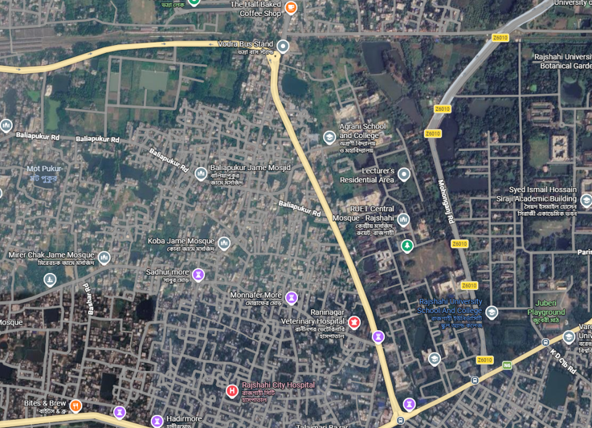
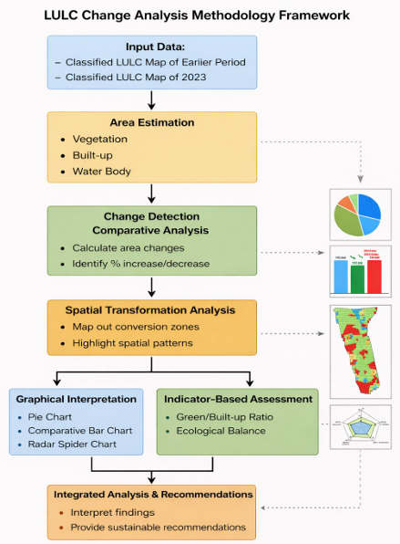
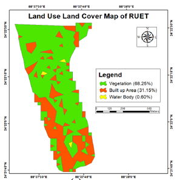
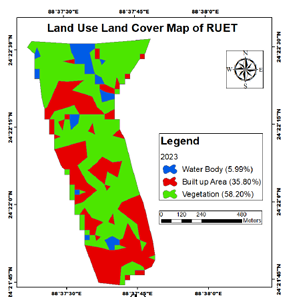
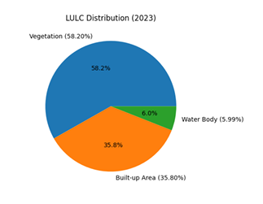
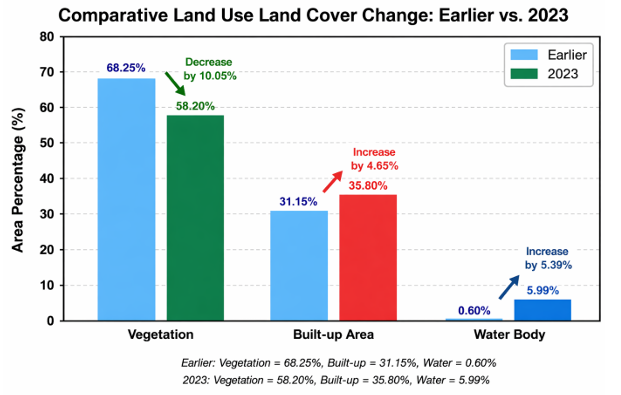
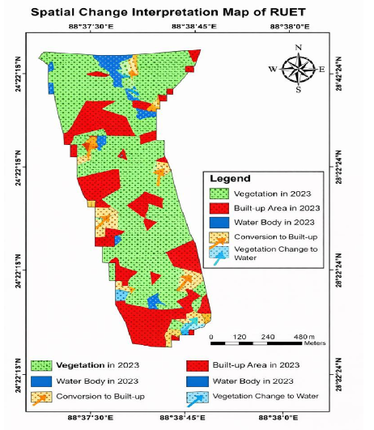
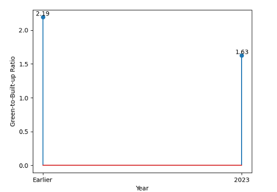
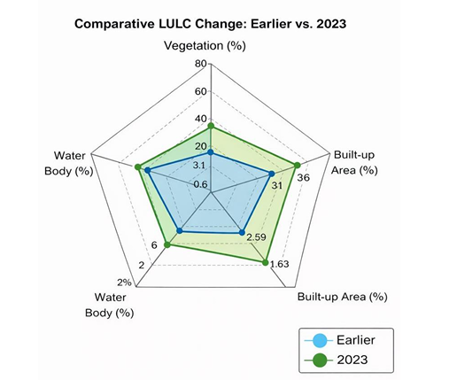

# Spatiotemporal LULC Change & Sustainability Assessment of RUET
### GIS-Based Analysis Using Landsat 8 | ArcGIS | Remote Sensing

---

## Overview

This project presents a **spatiotemporal assessment of Land Use–Land Cover (LULC) dynamics** in the **Rajshahi University of Engineering & Technology (RUET)** region, comparing land cover between **2013 and 2023** using GIS-based remote sensing techniques.

Key findings highlight:
- A **10.05% decline** in vegetation cover
- A **4.65% increase** in built-up area
- A **5.39% increase** in water bodies
- Green-to-built-up ratio dropped from **2.19 → 1.63** (~25% reduction in ecological dominance)

> The study emphasizes the need for strategic land management interventions to mitigate ecological degradation and ensure sustainable development.

---

##  Study Area

The study focuses on the **RUET (Rajshahi University of Engineering & Technology)** region — a peri-urban institutional area where land transformation occurs in fragmented and spatially heterogeneous patterns.

---

## 🔬 Methodology

The analysis follows an integrated framework combining **quantitative, spatial, and graphical** analysis:

| Stage | Description |
|-------|-------------|
| **Input Data** | Classified LULC maps for 2013 and 2023 |
| **Area Estimation** | Compute area for Vegetation, Built-up, and Water Body classes |
| **Change Detection** | Calculate % increase/decrease per class |
| **Spatial Analysis** | Map conversion zones and spatial patterns |
| **Graphical Interpretation** | Pie charts, bar charts, radar spider charts |
| **Indicator Assessment** | Green/Built-up ratio, Ecological Balance metric |

**Classification Tool:** Maximum Likelihood Classifier in ArcGIS  
**Imagery Source:** Landsat 8 OLI  
**Classes:** Vegetation | Built-up Area | Water Body  

---

## 🗺️ LULC Maps

### 2013

### 2023

---

## 📊 Results & Analysis

### 3.1 LULC Distribution (2023)

| Class | Coverage (%) |
|-------|-------------|
| Vegetation | 58.20% |
| Built-up Area | 35.80% |
| Water Body | 5.99% |

---

### 3.2 Quantitative Change Analysis (2013 → 2023)

| Class | Earlier (%) | 2023 (%) | Change |
|-------|-------------|----------|--------|
| Vegetation | 68.25% | 58.20% | **−10.05%** |
| Built-up Area | 31.15% | 35.80% | **+4.65%** |
| Water Body | 0.60% | 5.99% | **+5.39%** |

> **Note:** The vegetation decline reflects active land conversion. The water body increase, originating from a very low baseline (0.60%), may reflect seasonal variability, improved classification resolution, or localized water accumulation.

---

### 3.3 Spatial Transformation Dynamics

Land transformation is **not uniformly distributed** — it is concentrated in specific zones, characterized by:
- Clustering of built-up expansion in previously vegetated regions
- Fragmentation of continuous vegetation patches
- Emergence of small and scattered water bodies

---

### 3.4 Ecological Balance Assessment

The **green-to-built-up ratio** decreased from **2.19 → 1.63**, representing a ~25% reduction in vegetation's ecological dominance.

**Environmental implications:**
- Reduced capacity for carbon sequestration
- Increased impervious surface area
- Higher susceptibility to urban heat island effects

---

### 3.5 Integrated Multi-Indicator Radar Analysis

The radar chart confirms a **structural shift** in the LULC system — not just isolated class changes — with contraction of vegetation dominance, expansion of built-up footprint, and relative increase in water representation.

---

## Accuracy Assessment

Classification accuracy was validated using **confusion matrices** with 150 sample points (50 per class).

### 2015 Classification — Landsat 8 OLI

| | Vegetation | Built-up | Water Body | Row Total | User's Acc. |
|---|---|---|---|---|---|
| **Vegetation** | 44 | 4 | 2 | 50 | 88.00% |
| **Built-up** | 3 | 43 | 2 | 48 | 89.58% |
| **Water Body** | 1 | 2 | 49 | 52 | 94.23% |
| **Producer's Acc.** | 91.67% | 87.76% | 92.45% | | |

| Metric | Value |
|--------|-------|
| Overall Accuracy | **90.67%** |
| Kappa Coefficient (κ) | **0.86** |
| Correctly Classified | 136 / 150 |

---

### 2025 Classification — Landsat 8 OLI

| | Vegetation | Built-up | Water Body | Row Total | User's Acc. |
|---|---|---|---|---|---|
| **Vegetation** | 46 | 3 | 1 | 50 | 92.00% |
| **Built-up** | 2 | 45 | 2 | 49 | 91.84% |
| **Water Body** | 1 | 1 | 49 | 51 | 96.08% |
| **Producer's Acc.** | 93.88% | 91.84% | 94.23% | | |

| Metric | Value |
|--------|-------|
| Overall Accuracy | **93.33%** |
| Kappa Coefficient (κ) | **0.90** |
| Correctly Classified | 140 / 150 |

> Kappa Coefficient ≥ 0.80 indicates **strong classification agreement** (Landis & Koch, 1977).

---

## Sustainability Perspective & Recommendations

The results indicate a shift toward **unsustainable land transformation trends**. The decreasing ecological ratio coupled with spatial fragmentation suggests declining environmental resilience.

**Recommended interventions:**
- Implement land use zoning policies to control expansion
- Preserve and reconnect fragmented vegetation patches
- Develop integrated water management systems
- Introduce green infrastructure (urban forestry, green roofs)
- Promote sustainable institutional development planning

---

## Conclusion

The RUET region is at a **critical transitional stage** — vegetation remains dominant but is declining steadily, while built-up area expands progressively. The spatial concentration and fragmentation of these changes amplifies their environmental impact beyond what area percentages alone suggest.

Timely planning interventions can prevent long-term environmental degradation and guide the region toward sustainable development.

---

## Tools & Technologies

| Tool | Purpose |
|------|---------|
| ArcGIS | Supervised classification (Maximum Likelihood) |
| Landsat 8 OLI | Multispectral satellite imagery |
| Google Earth | Reference imagery for training samples |
| Field Verification | Ground truth for sample validation |

---

  Made with ❤️ for sustainable urban planning research

